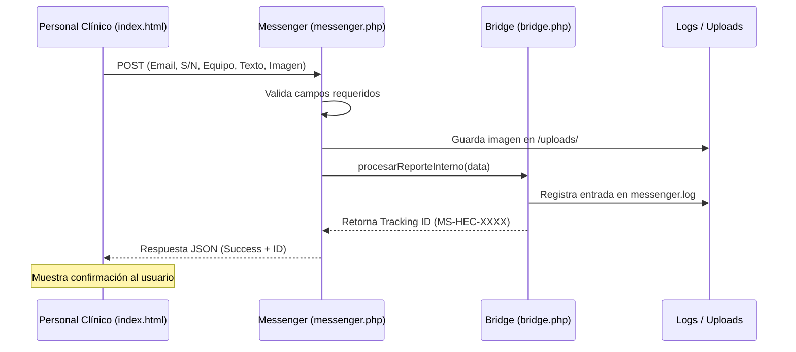
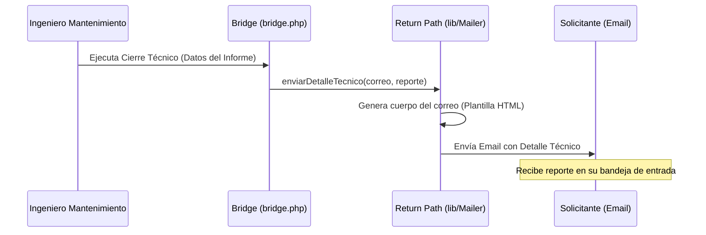

# Flujos de Trabajo - Messenger HEC (Standalone)

Este documento describe los flujos de comunicación bidireccional implementados en la carpeta `Diseño/API Mail/`.

## 1. Flujo de Reporte (Solicitud Clínica)
Este es el camino que recorren los datos desde que el personal clínico detecta una falla hasta que el sistema la registra.

## 2. Flujo de Respuesta (Feedback Técnico)
Este flujo representa la vuelta de información hacia el solicitante una vez que mantenimiento procesa el caso.

## Detalles de Integración Standalone
- **Entrada**: Formulario modernizado con vista previa de imagen.
- **Almacenamiento**: Las imágenes se guardan de forma física para evitar pérdida de evidencia.
- **Rastreo**: Cada reporte genera un `tracking_id` único para seguimiento manual por ahora.
- **Logs**: El archivo `messenger.log` actúa como nuestra "base de datos" temporal.
